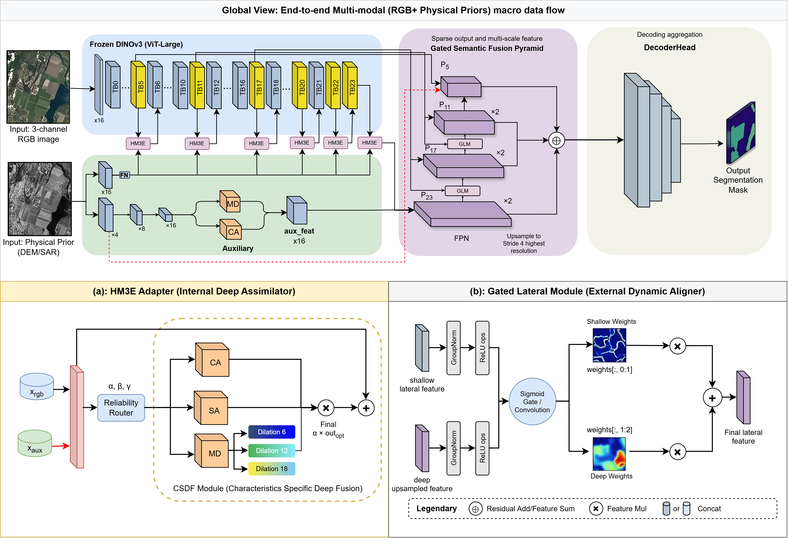

# M2-DINO
# 🌍 M2-DINO: Multi-Modal Gated Fusion Network for Few-Shot Remote Sensing Segmentation with Frozen DINOv3

[](https://pytorch.org/)
[](https://opensource.org/licenses/MIT)
[](#) *(Coming Soon)*

> **Official PyTorch implementation of the paper:** "Geo-Prior Guided Fine-Tuning: A Gated Multi-Modal Fusion Network for Few-Shot Remote Sensing Semantic Segmentation with Frozen Vision Transformers"

This repository provides a **lightweight, multi-modal, and high-performance** semantic segmentation network tailored for high-resolution remote sensing imagery. By cleverly combining a frozen **DINOv3 (ViT-Large)** backbone with our proposed **H-M3E (Hierarchical Multi-Modal Mixture-of-Experts)** and **SimpleUperHead**, the model achieves state-of-the-art performance with remarkably low training costs.

---

## 🔥 Highlights (Core Capabilities)

* 🚀 **Parameter-Efficient "Surgical" Tuning**: We freeze the majority of the ViT-Large backbone to retain its robust universal priors and only unfreeze the head, tail (Layers 5, 23), normalization layers, and adapters. This drastically reduces GPU memory consumption and prevents overfitting in few-shot scenarios.
* 🧠 **Deep Multi-Modal Interaction (H-M3E)**: Replaces naive concatenation with a dynamic Reliability Router. It adaptively routes features through decoupled experts (LoRA-Opt, LoRA-Aux, Spatial Expert) and merges them via a **Channel-Spatial Dense Fusion (CSDF)** module.
* ⚡ **Lightweight & Efficient Head**: We replace the heavy Mask2Former with a streamlined **SimpleUperHead**, significantly reducing inference latency and making deployment feasible without sacrificing accuracy.
* 🔍 **Full-Scale Perception**: Integrates **Spatial Gated Fusion** in deep layers for semantic alignment, and **Shallow Injection** (Stride-4) from an Auxiliary CNN Expert to preserve high-frequency details like tiny boundaries and small objects.

---

## 🏗️ Architecture Overview



Our model adopts a **Dual-Stream + Interactive** design paradigm:
1.  **Optical Stream (Main)**: Powered by DINOv3 (ViT-Large). Processes RGB images.
2.  **Auxiliary Stream (Side)**: A lightweight 3-layer CNN processes multi-modal auxiliary data (e.g., NDVI, SAR, DSM). It provides *Shallow Injection* for high-res details and *Deep Gates/Features* for semantic guidance.
3.  **Deep Interaction**: H-M3E Adapters are inserted into ViT layers 18, 20, and 22 for token-level multimodal mixing.
4.  **Decoding**: An asymmetric FPN combined with a SimpleUperHead fuses multi-scale features (P4, P8, P16, P32) for final pixel-level classification.

## 📊 Comparison Results

Here are the comparison results showing our method's effectiveness:

### WHU-OPT-SAR Dataset


### Low Shot Performance Comparison


### DW12C Low Shot Performance


---

## 📈 Ablation Study Results

| Model      | Baseline | H-M3E | SGP | TASC | OA (%) | Kappa (%) | mIoU (%) |
|------------|----------|-------|-----|------|--------|-----------|----------|
| #1 (Baseline) | ✓        |       |     |      | 77.19  | 67.21     | 44.41    |
| #2          | ✓        | ✓     |     |      | 82.29  | 75.73     | 54.80    |
| #3          | ✓        | ✓     | ✓   |      | 83.72  | 76.82     | 54.80    |
| #4 (M2-DINO) | ✓        | ✓     | ✓   | ✓    | 84.26  | 77.01     | 57.50    |

---

## 🛠️ Getting Started

### 1. Installation
```bash
# Clone the repository
git clone [https://github.com/YourUsername/Geo-Gated-Net.git](https://github.com/YourUsername/Geo-Gated-Net.git)
cd Geo-Gated-Net

# Create conda environment
conda create -n geo-gated python=3.10 -y
conda activate geo-gated

# Install PyTorch and dependencies
pip install torch torchvision torchaudio --index-url [https://download.pytorch.org/whl/cu118](https://download.pytorch.org/whl/cu118)
pip install -r requirements.txt